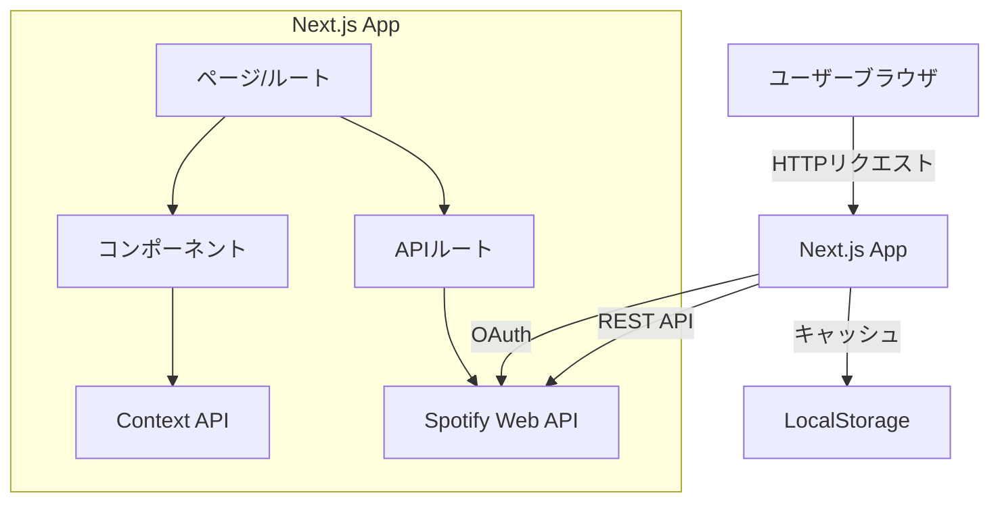
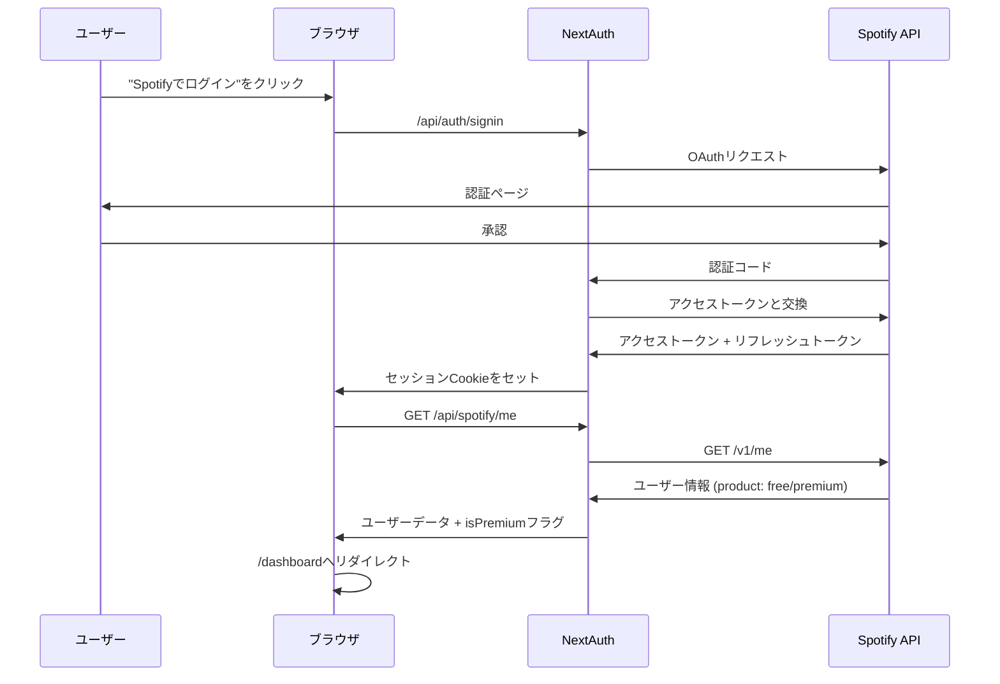
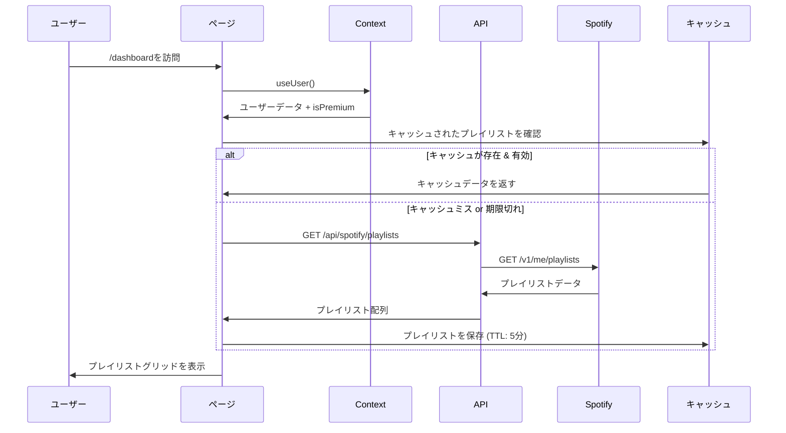
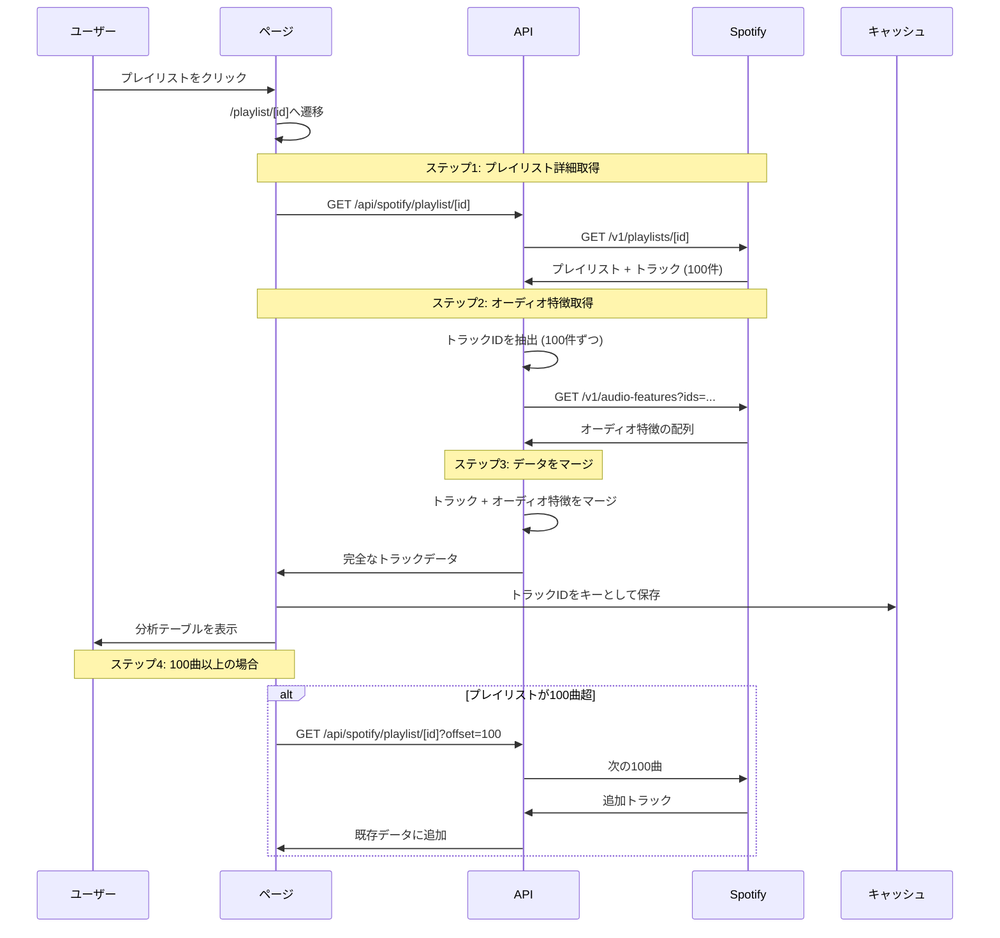
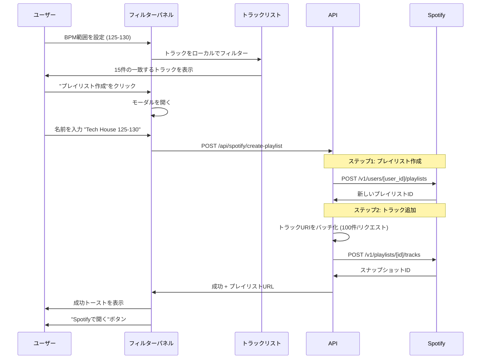
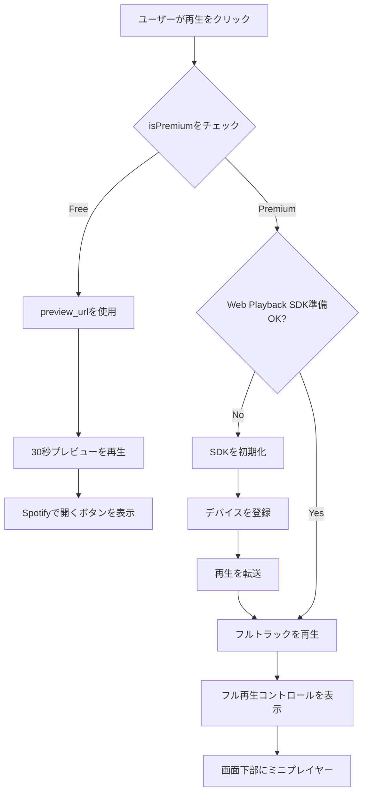
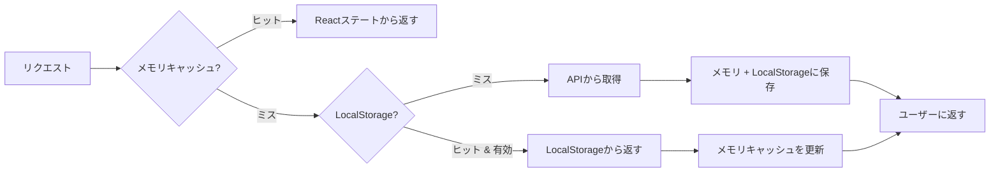

# アーキテクチャ & データフロー

## 概要

このドキュメントは、Spotify Playlist Analyzerアプリケーションの完全なアーキテクチャとデータフローを説明します。

---

## 目次

1. [システムアーキテクチャ](#システムアーキテクチャ)
2. [データフロー図](#データフロー図)
3. [状態管理](#状態管理)
4. [APIエンドポイント](#apiエンドポイント)
5. [キャッシュ戦略](#キャッシュ戦略)
6. [型定義](#型定義)

---

## システムアーキテクチャ



---

## データフロー図

### 1. 認証フロー



---

### 2. ダッシュボードのデータフロー



---

### 3. プレイリスト分析フロー



---

### 4. フィルター & プレイリスト作成フロー



---

### 5. 再生フロー (Free vs Premium)



---

## 状態管理

### グローバルステート (Context API)

```typescript
// lib/contexts/AppContext.tsx

interface AppContextType {
  // ユーザー
  user: SpotifyUser | null;
  isPremium: boolean;

  // プレイリスト
  playlists: Playlist[];
  currentPlaylist: PlaylistWithTracks | null;

  // トラック & 分析
  tracks: TrackWithFeatures[];
  filteredTracks: TrackWithFeatures[];

  // フィルター
  activeFilters: Filters | null;
  savedPresets: FilterPreset[];

  // 再生
  currentTrack: Track | null;
  isPlaying: boolean;
  playbackType: 'preview' | 'full' | null;

  // UI状態
  isLoading: boolean;
  error: AppError | null;

  // アクション
  setUser: (user: SpotifyUser) => void;
  setPlaylists: (playlists: Playlist[]) => void;
  setCurrentPlaylist: (playlist: PlaylistWithTracks) => void;
  applyFilters: (filters: Filters) => void;
  savePreset: (preset: FilterPreset) => void;
  playTrack: (track: Track) => void;
  pauseTrack: () => void;
}
```

### コンポーネントレベルの状態

```typescript
// 共有不要なUI固有の状態のみ

// Dashboard.tsx
const [searchQuery, setSearchQuery] = useState('');
const [sortBy, setSortBy] = useState<'name' | 'updated' | 'tracks'>('name');

// PlaylistDetail.tsx
const [selectedTracks, setSelectedTracks] = useState<string[]>([]);
const [showFilterModal, setShowFilterModal] = useState(false);

// TrackRow.tsx
const [isHovered, setIsHovered] = useState(false);
```

---

## APIエンドポイント

### 認証

#### `POST /api/auth/signin`
SpotifyのOAuth用NextAuthエンドポイント。

#### `POST /api/auth/callback/spotify`
OAuthコールバックハンドラー。

#### `GET /api/auth/session`
現在のセッションを取得。

---

### Spotify APIプロキシ

すべてのエンドポイントは認証が必要。トークンは自動的にセッションから含まれます。

#### `GET /api/spotify/me`
現在のユーザー情報を取得。

**レスポンス:**
```typescript
{
  id: string;
  display_name: string;
  email: string;
  product: 'free' | 'premium';  // Premium判定のキー
  images: { url: string }[];
}
```

---

#### `GET /api/spotify/playlists`
ユーザーのプレイリストを取得。

**クエリパラメータ:**
- `limit`: number (デフォルト: 50, 最大: 50)
- `offset`: number (デフォルト: 0)

**レスポンス:**
```typescript
{
  items: Playlist[];
  total: number;
  next: string | null;
}
```

**キャッシュ:** 5分

---

#### `GET /api/spotify/playlist/:id`
トラック付きのプレイリスト詳細を取得。

**クエリパラメータ:**
- `offset`: number (デフォルト: 0) - ページネーション用
- `limit`: number (デフォルト: 100, 最大: 100)

**レスポンス:**
```typescript
{
  id: string;
  name: string;
  description: string;
  images: { url: string }[];
  tracks: {
    total: number;
    items: PlaylistTrack[];
  };
}
```

**注意:** このエンドポイントはすべてのトラックのオーディオ特徴を自動的に取得します。

---

#### `GET /api/spotify/audio-features`
複数トラックのオーディオ特徴を取得。

**クエリパラメータ:**
- `ids`: string (カンマ区切りのトラックID、最大100)

**レスポンス:**
```typescript
{
  audio_features: AudioFeatures[];
}

interface AudioFeatures {
  id: string;
  tempo: number;        // BPM
  key: number;          // 0-11 (C, C#, D, ...)
  mode: number;         // 0: minor, 1: major
  energy: number;       // 0-1
  danceability: number; // 0-1
  valence: number;      // 0-1
  acousticness: number;
  instrumentalness: number;
  liveness: number;
  loudness: number;
  speechiness: number;
  time_signature: number;
}
```

**キャッシュ:** 永続 (オーディオ特徴は変更されない)

---

#### `POST /api/spotify/create-playlist`
新しいプレイリストを作成してトラックを追加。

**リクエストボディ:**
```typescript
{
  name: string;
  description?: string;
  public: boolean;
  trackUris: string[];  // spotify:track:xxx 形式
}
```

**レスポンス:**
```typescript
{
  id: string;
  name: string;
  external_urls: {
    spotify: string;  // Spotifyで開くURL
  };
  snapshot_id: string;
}
```

**処理:**
1. `POST /v1/users/{user_id}/playlists` でプレイリスト作成
2. `POST /v1/playlists/{id}/tracks` で100件ずつトラック追加

---

## キャッシュ戦略

### 3層キャッシュ



### 第1層: メモリキャッシュ (Reactステート)

**保存先:** Context API / コンポーネントステート
**有効期限:** ページリフレッシュまたは遷移まで
**用途:** 現在アクティブなデータ

```typescript
// AppContextに保存
{
  playlists: Playlist[];           // すべてのプレイリスト
  currentPlaylist: PlaylistDetail; // アクティブなプレイリスト
  tracks: TrackWithFeatures[];     // 現在のトラック + 特徴
}
```

---

### 第2層: LocalStorage

**保存先:** ブラウザのLocalStorage
**有効期限:** TTL付きで永続
**用途:** ユーザー設定、最近のデータ

```typescript
// localStorageのキー
interface LocalStorageSchema {
  'app_version': string;  // マイグレーション用
  'user_prefs': {
    theme: 'dark' | 'light';
    sortBy: string;
    lastViewedPlaylist: string;
  };
  'saved_presets': FilterPreset[];
  'recent_playlists': {
    id: string;
    timestamp: number;
  }[];
  'cache_playlists': {
    data: Playlist[];
    timestamp: number;
    ttl: number;  // 5分
  };
  'cache_audio_features': {
    [trackId: string]: {
      data: AudioFeatures;
      timestamp: number;
      // TTLなし - 永続キャッシュ
    };
  };
}
```

**ヘルパー関数:**
```typescript
// lib/cache.ts

export const cache = {
  set: (key: string, value: any, ttl?: number) => {
    const item = {
      data: value,
      timestamp: Date.now(),
      ttl: ttl || null,
    };
    localStorage.setItem(key, JSON.stringify(item));
  },

  get: <T>(key: string): T | null => {
    const item = localStorage.getItem(key);
    if (!item) return null;

    const { data, timestamp, ttl } = JSON.parse(item);

    // 有効期限チェック
    if (ttl && Date.now() - timestamp > ttl) {
      localStorage.removeItem(key);
      return null;
    }

    return data as T;
  },

  clear: (key: string) => {
    localStorage.removeItem(key);
  },

  clearAll: () => {
    localStorage.clear();
  },
};
```

---

### 第3層: サーバーサイドキャッシュ (将来 - Supabase)

**保存先:** Supabaseデータベース
**有効期限:** 永続
**用途:** クロスデバイス同期、分析

```sql
-- 将来のスキーマ
CREATE TABLE user_playlists (
  id UUID PRIMARY KEY,
  user_id VARCHAR NOT NULL,
  playlist_id VARCHAR NOT NULL,
  last_analyzed TIMESTAMP,
  track_count INTEGER,
  avg_bpm DECIMAL,
  created_at TIMESTAMP DEFAULT NOW()
);

CREATE TABLE user_presets (
  id UUID PRIMARY KEY,
  user_id VARCHAR NOT NULL,
  name VARCHAR NOT NULL,
  filters JSONB NOT NULL,
  created_at TIMESTAMP DEFAULT NOW()
);
```

---

### キャッシュ無効化ルール

| データタイプ | TTL | 無効化トリガー |
|------------|-----|--------------|
| ユーザー情報 | セッション | ログアウト |
| プレイリスト一覧 | 5分 | 手動更新 |
| プレイリスト詳細 | 10分 | 手動更新 |
| オーディオ特徴 | 永続 | なし (不変) |
| ユーザープリセット | 永続 | ユーザー削除 |
| 最近のプレイリスト | 30日 | 経過時間 |

---

## 型定義

### コア型

```typescript
// types/spotify.ts

export interface SpotifyUser {
  id: string;
  display_name: string;
  email: string;
  product: 'free' | 'premium';
  images: SpotifyImage[];
  country: string;
  followers: { total: number };
}

export interface SpotifyImage {
  url: string;
  height: number | null;
  width: number | null;
}

export interface Playlist {
  id: string;
  name: string;
  description: string | null;
  images: SpotifyImage[];
  tracks: {
    total: number;
  };
  owner: {
    id: string;
    display_name: string;
  };
  public: boolean;
  collaborative: boolean;
  snapshot_id: string;
  external_urls: {
    spotify: string;
  };
}

export interface PlaylistWithTracks extends Playlist {
  tracks: {
    total: number;
    items: PlaylistTrack[];
    next: string | null;
    previous: string | null;
  };
}

export interface PlaylistTrack {
  added_at: string;
  added_by: {
    id: string;
  };
  is_local: boolean;
  track: Track;
}

export interface Track {
  id: string;
  name: string;
  artists: Artist[];
  album: Album;
  duration_ms: number;
  explicit: boolean;
  preview_url: string | null;  // 30秒プレビュー
  uri: string;                 // spotify:track:xxx
  external_urls: {
    spotify: string;
  };
  is_playable: boolean;
}

export interface Artist {
  id: string;
  name: string;
  external_urls: {
    spotify: string;
  };
}

export interface Album {
  id: string;
  name: string;
  images: SpotifyImage[];
  release_date: string;
}

export interface AudioFeatures {
  id: string;
  tempo: number;              // BPM
  key: number;                // 0-11
  mode: number;               // 0: minor, 1: major
  time_signature: number;     // 3, 4, 5, etc.
  energy: number;             // 0-1
  danceability: number;       // 0-1
  valence: number;            // 0-1 (幸福度)
  acousticness: number;       // 0-1
  instrumentalness: number;   // 0-1
  liveness: number;           // 0-1
  loudness: number;           // dB
  speechiness: number;        // 0-1
}

export interface TrackWithFeatures {
  track: Track;
  features: AudioFeatures | null;
  addedAt: string;
}
```

---

### フィルター型

```typescript
// types/filters.ts

export interface Filters {
  bpmRange: [number, number];          // [120, 135]
  keys: number[];                      // [0, 7] = C, G
  mode: 'major' | 'minor' | null;
  energyRange: [number, number];      // [0.7, 1.0]
  danceabilityRange?: [number, number];
  valenceRange?: [number, number];
}

export interface FilterPreset {
  id: string;
  name: string;
  filters: Filters;
  createdAt: string;
  usageCount: number;
}

// 事前定義プリセット
export const DEFAULT_PRESETS: FilterPreset[] = [
  {
    id: 'tech-house',
    name: 'Tech House (125-128)',
    filters: {
      bpmRange: [125, 128],
      keys: [],
      mode: null,
      energyRange: [0.6, 0.9],
    },
    createdAt: new Date().toISOString(),
    usageCount: 0,
  },
  {
    id: 'techno',
    name: 'Techno (128-135)',
    filters: {
      bpmRange: [128, 135],
      keys: [],
      mode: null,
      energyRange: [0.7, 1.0],
    },
    createdAt: new Date().toISOString(),
    usageCount: 0,
  },
  {
    id: 'progressive',
    name: 'Progressive House (120-125)',
    filters: {
      bpmRange: [120, 125],
      keys: [],
      mode: null,
      energyRange: [0.5, 0.8],
    },
    createdAt: new Date().toISOString(),
    usageCount: 0,
  },
];
```

---

### 再生型

```typescript
// types/playback.ts

export interface PlaybackState {
  currentTrack: Track | null;
  isPlaying: boolean;
  isPaused: boolean;
  position: number;        // ミリ秒
  duration: number;        // ミリ秒
  volume: number;          // 0-1
  playbackType: 'preview' | 'full';
  deviceId: string | null; // Web Playback SDKデバイス
}

export interface PlaybackCapability {
  canPlayPreview: boolean;  // 常にtrue
  canPlayFull: boolean;     // Premiumのみ
  sdkReady: boolean;        // Web Playback SDK初期化済み
}
```

---

### エラー型

```typescript
// types/errors.ts

export interface AppError {
  code: ErrorCode;
  message: string;
  details?: any;
  timestamp: string;
}

export enum ErrorCode {
  // 認証エラー
  AUTH_FAILED = 'AUTH_FAILED',
  TOKEN_EXPIRED = 'TOKEN_EXPIRED',
  SESSION_INVALID = 'SESSION_INVALID',

  // APIエラー
  API_ERROR = 'API_ERROR',
  RATE_LIMIT = 'RATE_LIMIT',
  NETWORK_ERROR = 'NETWORK_ERROR',

  // Spotifyエラー
  PREMIUM_REQUIRED = 'PREMIUM_REQUIRED',
  PLAYBACK_ERROR = 'PLAYBACK_ERROR',
  PLAYLIST_NOT_FOUND = 'PLAYLIST_NOT_FOUND',

  // クライアントエラー
  INVALID_FILTERS = 'INVALID_FILTERS',
  CACHE_ERROR = 'CACHE_ERROR',
}
```

---

## データ処理パターン

### 1. 大規模プレイリストのバッチ処理

```typescript
// lib/spotify-utils.ts

export async function fetchAllTracksWithFeatures(
  playlistId: string,
  token: string
): Promise<TrackWithFeatures[]> {
  const allTracks: TrackWithFeatures[] = [];
  let offset = 0;
  const limit = 100;

  // ステップ1: すべてのトラックを取得 (ページネーション)
  while (true) {
    const response = await fetch(
      `https://api.spotify.com/v1/playlists/${playlistId}/tracks?offset=${offset}&limit=${limit}`,
      { headers: { Authorization: `Bearer ${token}` } }
    );

    const data = await response.json();
    allTracks.push(...data.items);

    if (!data.next) break;
    offset += limit;
  }

  // ステップ2: トラックIDを抽出
  const trackIds = allTracks.map(item => item.track.id);

  // ステップ3: オーディオ特徴を100件ずつ取得
  const features: AudioFeatures[] = [];
  for (let i = 0; i < trackIds.length; i += 100) {
    const batch = trackIds.slice(i, i + 100);
    const response = await fetch(
      `https://api.spotify.com/v1/audio-features?ids=${batch.join(',')}`,
      { headers: { Authorization: `Bearer ${token}` } }
    );
    const data = await response.json();
    features.push(...data.audio_features);
  }

  // ステップ4: トラックと特徴をマージ
  return allTracks.map((item, index) => ({
    track: item.track,
    features: features[index] || null,
    addedAt: item.added_at,
  }));
}
```

---

### 2. クライアントサイドフィルタリング

```typescript
// lib/filter-utils.ts

export function applyFilters(
  tracks: TrackWithFeatures[],
  filters: Filters
): TrackWithFeatures[] {
  return tracks.filter(({ features }) => {
    if (!features) return false;

    // BPMフィルター
    if (
      features.tempo < filters.bpmRange[0] ||
      features.tempo > filters.bpmRange[1]
    ) {
      return false;
    }

    // キーフィルター
    if (filters.keys.length > 0 && !filters.keys.includes(features.key)) {
      return false;
    }

    // モードフィルター
    if (filters.mode !== null) {
      const expectedMode = filters.mode === 'major' ? 1 : 0;
      if (features.mode !== expectedMode) return false;
    }

    // エネルギーフィルター
    if (
      features.energy < filters.energyRange[0] ||
      features.energy > filters.energyRange[1]
    ) {
      return false;
    }

    return true;
  });
}
```

---

### 3. Rate Limit処理

```typescript
// lib/api-utils.ts

export async function fetchWithRetry(
  url: string,
  options: RequestInit,
  maxRetries = 3
): Promise<Response> {
  for (let i = 0; i < maxRetries; i++) {
    const response = await fetch(url, options);

    if (response.status === 429) {
      // Rate Limited
      const retryAfter = response.headers.get('Retry-After');
      const waitTime = retryAfter ? parseInt(retryAfter) * 1000 : 2000 * (i + 1);

      console.warn(`Rate限制。${waitTime}ms後に再試行...`);
      await new Promise(resolve => setTimeout(resolve, waitTime));
      continue;
    }

    if (response.ok) return response;

    // その他のエラー
    if (i === maxRetries - 1) throw new Error(`リクエスト失敗: ${response.status}`);
  }

  throw new Error('最大リトライ回数を超えました');
}
```

---

## パフォーマンス考慮事項

### 遅延ロード戦略

```typescript
// components/playlist/TrackList.tsx

import { useVirtualizer } from '@tanstack/react-virtual';

export function TrackList({ tracks }: { tracks: TrackWithFeatures[] }) {
  const parentRef = useRef<HTMLDivElement>(null);

  // 大規模リスト用の仮想スクロール
  const virtualizer = useVirtualizer({
    count: tracks.length,
    getScrollElement: () => parentRef.current,
    estimateSize: () => 64, // 推定行高さ(ピクセル)
    overscan: 10, // 上下に10個余分にレンダリング
  });

  return (
    <div ref={parentRef} style={{ height: '600px', overflow: 'auto' }}>
      <div style={{ height: `${virtualizer.getTotalSize()}px` }}>
        {virtualizer.getVirtualItems().map((virtualRow) => (
          <TrackRow
            key={tracks[virtualRow.index].track.id}
            track={tracks[virtualRow.index]}
            style={{
              position: 'absolute',
              top: 0,
              left: 0,
              width: '100%',
              transform: `translateY(${virtualRow.start}px)`,
            }}
          />
        ))}
      </div>
    </div>
  );
}
```

---

## まとめ

このアーキテクチャは以下を提供します：

✅ **明確なデータフロー** - ユーザー操作からAPIからUIまで
✅ **効率的なキャッシュ** - 3層戦略
✅ **型安全性** - 完全なTypeScript定義
✅ **スケーラビリティ** - バッチ処理と仮想スクロール
✅ **回復力** - リトライロジックとエラーハンドリング
✅ **パフォーマンス** - 適切なメモ化と遅延ロード

すべての図はGitHub上でMermaidシンタックスを使用してレンダリングされます。

---

**最終更新:** 2024-10-22
**バージョン:** 1.0
