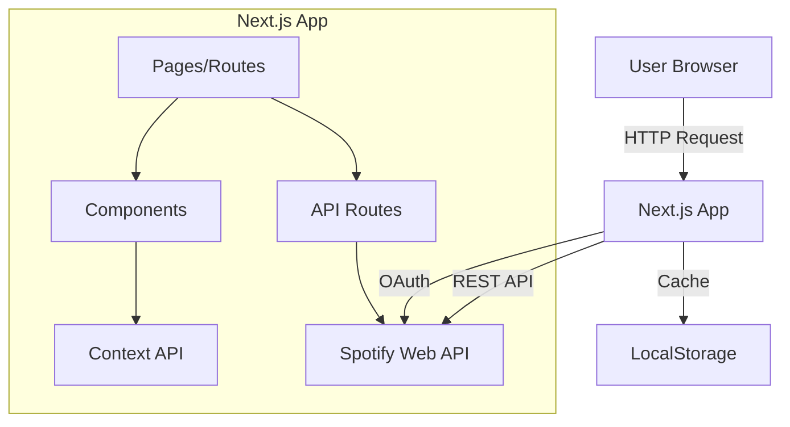
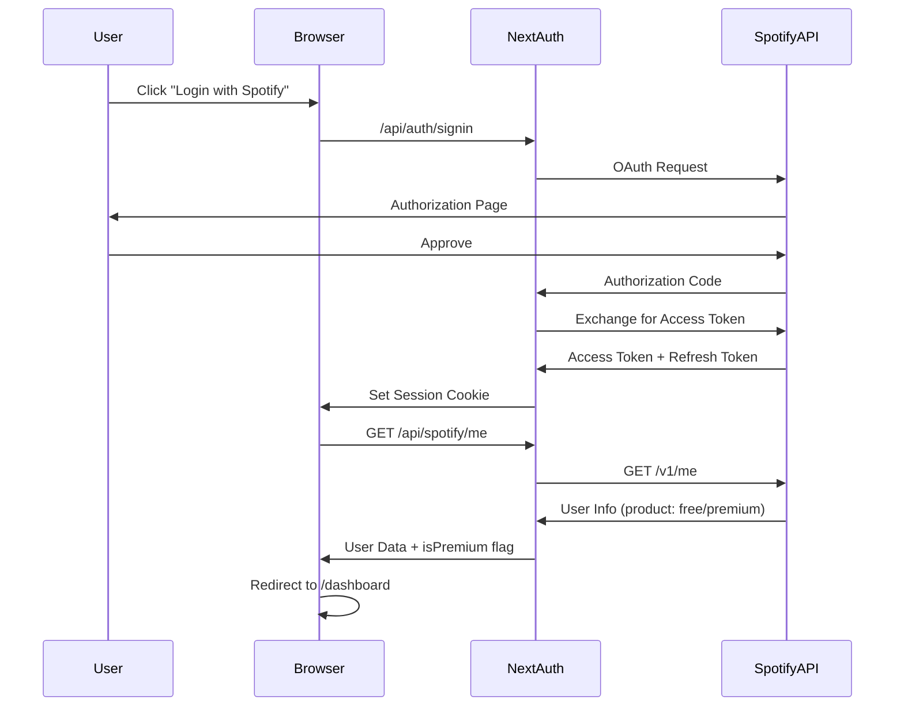
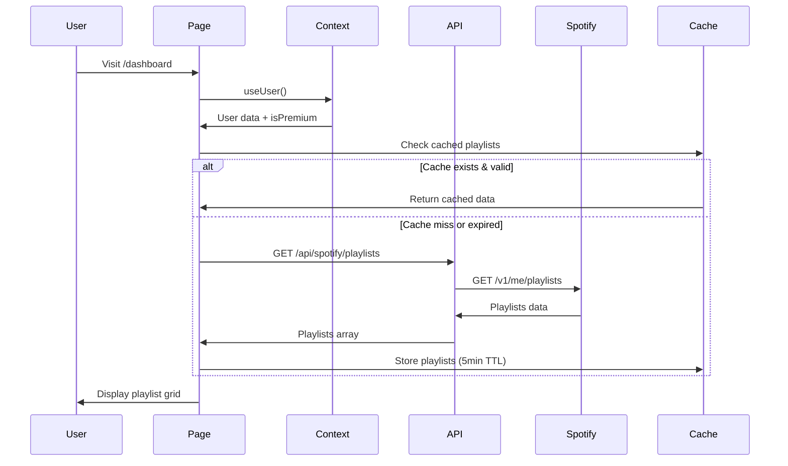
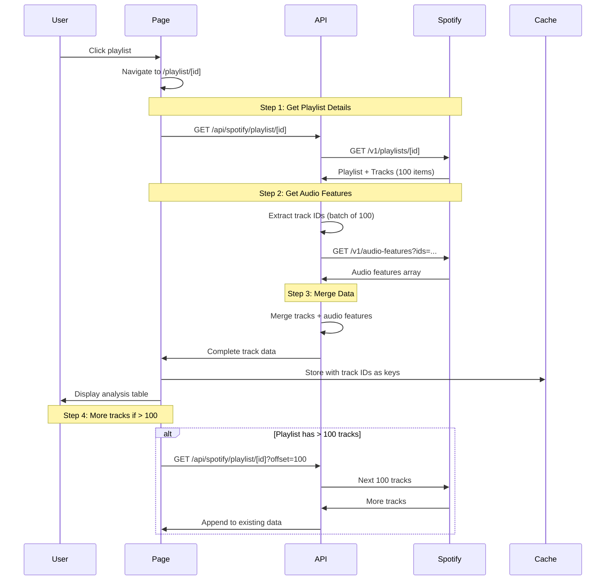
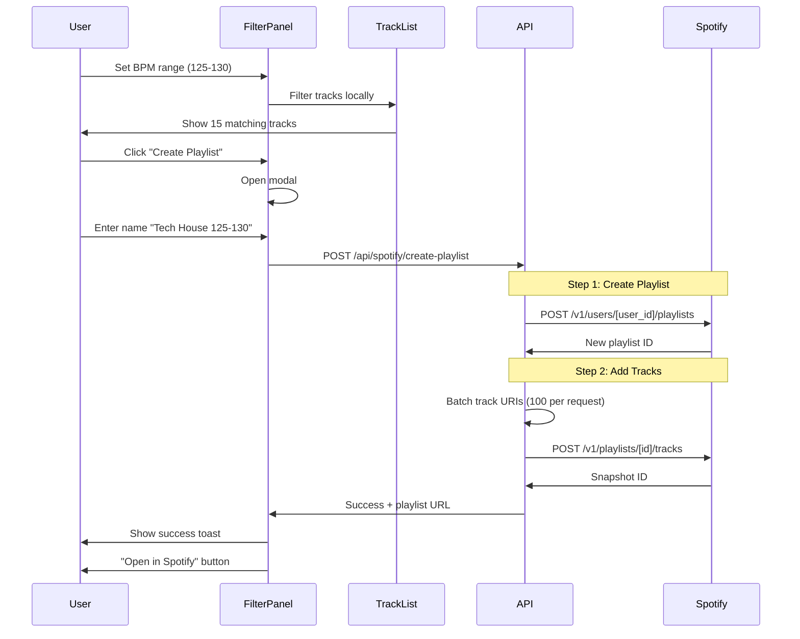
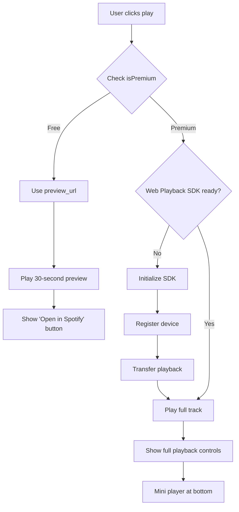
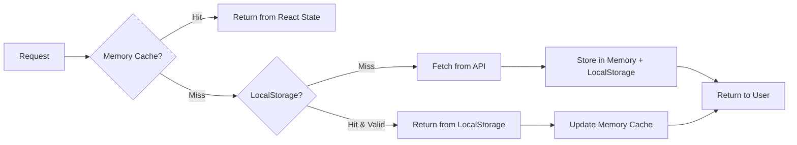

# Architecture & Data Flow

## Overview

This document describes the complete architecture and data flow of the Spotify Playlist Analyzer application.

---

## Table of Contents

1. [System Architecture](#system-architecture)
2. [Data Flow Diagrams](#data-flow-diagrams)
3. [State Management](#state-management)
4. [API Endpoints](#api-endpoints)
5. [Caching Strategy](#caching-strategy)
6. [Type Definitions](#type-definitions)

---

## System Architecture



---

## Data Flow Diagrams

### 1. Authentication Flow



---

### 2. Dashboard Data Flow



---

### 3. Playlist Analysis Flow



---

### 4. Filter & Create Playlist Flow



---

### 5. Playback Flow (Free vs Premium)



---

## State Management

### Global State (Context API)

```typescript
// lib/contexts/AppContext.tsx

interface AppContextType {
  // User
  user: SpotifyUser | null;
  isPremium: boolean;

  // Playlists
  playlists: Playlist[];
  currentPlaylist: PlaylistWithTracks | null;

  // Tracks & Analysis
  tracks: TrackWithFeatures[];
  filteredTracks: TrackWithFeatures[];

  // Filters
  activeFilters: Filters | null;
  savedPresets: FilterPreset[];

  // Playback
  currentTrack: Track | null;
  isPlaying: boolean;
  playbackType: 'preview' | 'full' | null;

  // UI State
  isLoading: boolean;
  error: AppError | null;

  // Actions
  setUser: (user: SpotifyUser) => void;
  setPlaylists: (playlists: Playlist[]) => void;
  setCurrentPlaylist: (playlist: PlaylistWithTracks) => void;
  applyFilters: (filters: Filters) => void;
  savePreset: (preset: FilterPreset) => void;
  playTrack: (track: Track) => void;
  pauseTrack: () => void;
}
```

### Component-Level State

```typescript
// Only for UI-specific state that doesn't need to be shared

// Dashboard.tsx
const [searchQuery, setSearchQuery] = useState('');
const [sortBy, setSortBy] = useState<'name' | 'updated' | 'tracks'>('name');

// PlaylistDetail.tsx
const [selectedTracks, setSelectedTracks] = useState<string[]>([]);
const [showFilterModal, setShowFilterModal] = useState(false);

// TrackRow.tsx
const [isHovered, setIsHovered] = useState(false);
```

---

## API Endpoints

### Authentication

#### `POST /api/auth/signin`
Next Auth endpoint for Spotify OAuth.

#### `POST /api/auth/callback/spotify`
OAuth callback handler.

#### `GET /api/auth/session`
Get current session.

---

### Spotify API Proxy

All endpoints require authentication. Token is automatically included from session.

#### `GET /api/spotify/me`
Get current user information.

**Response:**
```typescript
{
  id: string;
  display_name: string;
  email: string;
  product: 'free' | 'premium';  // Key for Premium detection
  images: { url: string }[];
}
```

---

#### `GET /api/spotify/playlists`
Get user's playlists.

**Query Parameters:**
- `limit`: number (default: 50, max: 50)
- `offset`: number (default: 0)

**Response:**
```typescript
{
  items: Playlist[];
  total: number;
  next: string | null;
}
```

**Caching:** 5 minutes

---

#### `GET /api/spotify/playlist/:id`
Get playlist details with tracks.

**Query Parameters:**
- `offset`: number (default: 0) - for pagination
- `limit`: number (default: 100, max: 100)

**Response:**
```typescript
{
  id: string;
  name: string;
  description: string;
  images: { url: string }[];
  tracks: {
    total: number;
    items: PlaylistTrack[];
  };
}
```

**Note:** This endpoint automatically fetches audio features for all tracks.

---

#### `GET /api/spotify/audio-features`
Get audio features for multiple tracks.

**Query Parameters:**
- `ids`: string (comma-separated track IDs, max 100)

**Response:**
```typescript
{
  audio_features: AudioFeatures[];
}

interface AudioFeatures {
  id: string;
  tempo: number;        // BPM
  key: number;          // 0-11 (C, C#, D, ...)
  mode: number;         // 0: minor, 1: major
  energy: number;       // 0-1
  danceability: number; // 0-1
  valence: number;      // 0-1
  acousticness: number;
  instrumentalness: number;
  liveness: number;
  loudness: number;
  speechiness: number;
  time_signature: number;
}
```

**Caching:** Permanent (audio features don't change)

---

#### `POST /api/spotify/create-playlist`
Create a new playlist and add tracks.

**Request Body:**
```typescript
{
  name: string;
  description?: string;
  public: boolean;
  trackUris: string[];  // spotify:track:xxx format
}
```

**Response:**
```typescript
{
  id: string;
  name: string;
  external_urls: {
    spotify: string;  // URL to open in Spotify
  };
  snapshot_id: string;
}
```

**Process:**
1. Create playlist via `POST /v1/users/{user_id}/playlists`
2. Add tracks in batches of 100 via `POST /v1/playlists/{id}/tracks`

---

## Caching Strategy

### Three-Tier Caching



### Tier 1: Memory Cache (React State)

**Storage:** Context API / Component State
**Lifetime:** Until page refresh or navigation
**Use Case:** Currently active data

```typescript
// Stored in AppContext
{
  playlists: Playlist[];           // All playlists
  currentPlaylist: PlaylistDetail; // Active playlist
  tracks: TrackWithFeatures[];     // Current tracks + features
}
```

---

### Tier 2: LocalStorage

**Storage:** Browser LocalStorage
**Lifetime:** Persistent with TTL
**Use Case:** User preferences, recent data

```typescript
// localStorage keys
interface LocalStorageSchema {
  'app_version': string;  // For migration
  'user_prefs': {
    theme: 'dark' | 'light';
    sortBy: string;
    lastViewedPlaylist: string;
  };
  'saved_presets': FilterPreset[];
  'recent_playlists': {
    id: string;
    timestamp: number;
  }[];
  'cache_playlists': {
    data: Playlist[];
    timestamp: number;
    ttl: number;  // 5 minutes
  };
  'cache_audio_features': {
    [trackId: string]: {
      data: AudioFeatures;
      timestamp: number;
      // No TTL - permanent cache
    };
  };
}
```

**Helper Functions:**
```typescript
// lib/cache.ts

export const cache = {
  set: (key: string, value: any, ttl?: number) => {
    const item = {
      data: value,
      timestamp: Date.now(),
      ttl: ttl || null,
    };
    localStorage.setItem(key, JSON.stringify(item));
  },

  get: <T>(key: string): T | null => {
    const item = localStorage.getItem(key);
    if (!item) return null;

    const { data, timestamp, ttl } = JSON.parse(item);

    // Check expiration
    if (ttl && Date.now() - timestamp > ttl) {
      localStorage.removeItem(key);
      return null;
    }

    return data as T;
  },

  clear: (key: string) => {
    localStorage.removeItem(key);
  },

  clearAll: () => {
    localStorage.clear();
  },
};
```

---

### Tier 3: Server-Side Cache (Future - Supabase)

**Storage:** Supabase Database
**Lifetime:** Persistent
**Use Case:** Cross-device sync, analytics

```sql
-- Future schema
CREATE TABLE user_playlists (
  id UUID PRIMARY KEY,
  user_id VARCHAR NOT NULL,
  playlist_id VARCHAR NOT NULL,
  last_analyzed TIMESTAMP,
  track_count INTEGER,
  avg_bpm DECIMAL,
  created_at TIMESTAMP DEFAULT NOW()
);

CREATE TABLE user_presets (
  id UUID PRIMARY KEY,
  user_id VARCHAR NOT NULL,
  name VARCHAR NOT NULL,
  filters JSONB NOT NULL,
  created_at TIMESTAMP DEFAULT NOW()
);
```

---

### Cache Invalidation Rules

| Data Type | TTL | Invalidation Trigger |
|-----------|-----|---------------------|
| User info | Session | Logout |
| Playlists list | 5 minutes | Manual refresh |
| Playlist details | 10 minutes | Manual refresh |
| Audio features | Permanent | Never (immutable) |
| User presets | Permanent | User deletion |
| Recent playlists | 30 days | Age |

---

## Type Definitions

### Core Types

```typescript
// types/spotify.ts

export interface SpotifyUser {
  id: string;
  display_name: string;
  email: string;
  product: 'free' | 'premium';
  images: SpotifyImage[];
  country: string;
  followers: { total: number };
}

export interface SpotifyImage {
  url: string;
  height: number | null;
  width: number | null;
}

export interface Playlist {
  id: string;
  name: string;
  description: string | null;
  images: SpotifyImage[];
  tracks: {
    total: number;
  };
  owner: {
    id: string;
    display_name: string;
  };
  public: boolean;
  collaborative: boolean;
  snapshot_id: string;
  external_urls: {
    spotify: string;
  };
}

export interface PlaylistWithTracks extends Playlist {
  tracks: {
    total: number;
    items: PlaylistTrack[];
    next: string | null;
    previous: string | null;
  };
}

export interface PlaylistTrack {
  added_at: string;
  added_by: {
    id: string;
  };
  is_local: boolean;
  track: Track;
}

export interface Track {
  id: string;
  name: string;
  artists: Artist[];
  album: Album;
  duration_ms: number;
  explicit: boolean;
  preview_url: string | null;  // 30-second preview
  uri: string;                 // spotify:track:xxx
  external_urls: {
    spotify: string;
  };
  is_playable: boolean;
}

export interface Artist {
  id: string;
  name: string;
  external_urls: {
    spotify: string;
  };
}

export interface Album {
  id: string;
  name: string;
  images: SpotifyImage[];
  release_date: string;
}

export interface AudioFeatures {
  id: string;
  tempo: number;              // BPM
  key: number;                // 0-11
  mode: number;               // 0: minor, 1: major
  time_signature: number;     // 3, 4, 5, etc.
  energy: number;             // 0-1
  danceability: number;       // 0-1
  valence: number;            // 0-1 (happiness)
  acousticness: number;       // 0-1
  instrumentalness: number;   // 0-1
  liveness: number;           // 0-1
  loudness: number;           // dB
  speechiness: number;        // 0-1
}

export interface TrackWithFeatures {
  track: Track;
  features: AudioFeatures | null;
  addedAt: string;
}
```

---

### Filter Types

```typescript
// types/filters.ts

export interface Filters {
  bpmRange: [number, number];          // [120, 135]
  keys: number[];                      // [0, 7] = C, G
  mode: 'major' | 'minor' | null;
  energyRange: [number, number];      // [0.7, 1.0]
  danceabilityRange?: [number, number];
  valenceRange?: [number, number];
}

export interface FilterPreset {
  id: string;
  name: string;
  filters: Filters;
  createdAt: string;
  usageCount: number;
}

// Predefined presets
export const DEFAULT_PRESETS: FilterPreset[] = [
  {
    id: 'tech-house',
    name: 'Tech House (125-128)',
    filters: {
      bpmRange: [125, 128],
      keys: [],
      mode: null,
      energyRange: [0.6, 0.9],
    },
    createdAt: new Date().toISOString(),
    usageCount: 0,
  },
  {
    id: 'techno',
    name: 'Techno (128-135)',
    filters: {
      bpmRange: [128, 135],
      keys: [],
      mode: null,
      energyRange: [0.7, 1.0],
    },
    createdAt: new Date().toISOString(),
    usageCount: 0,
  },
  {
    id: 'progressive',
    name: 'Progressive House (120-125)',
    filters: {
      bpmRange: [120, 125],
      keys: [],
      mode: null,
      energyRange: [0.5, 0.8],
    },
    createdAt: new Date().toISOString(),
    usageCount: 0,
  },
];
```

---

### Playback Types

```typescript
// types/playback.ts

export interface PlaybackState {
  currentTrack: Track | null;
  isPlaying: boolean;
  isPaused: boolean;
  position: number;        // milliseconds
  duration: number;        // milliseconds
  volume: number;          // 0-1
  playbackType: 'preview' | 'full';
  deviceId: string | null; // Web Playback SDK device
}

export interface PlaybackCapability {
  canPlayPreview: boolean;  // Always true
  canPlayFull: boolean;     // Premium only
  sdkReady: boolean;        // Web Playback SDK initialized
}
```

---

### Error Types

```typescript
// types/errors.ts

export interface AppError {
  code: ErrorCode;
  message: string;
  details?: any;
  timestamp: string;
}

export enum ErrorCode {
  // Auth errors
  AUTH_FAILED = 'AUTH_FAILED',
  TOKEN_EXPIRED = 'TOKEN_EXPIRED',
  SESSION_INVALID = 'SESSION_INVALID',

  // API errors
  API_ERROR = 'API_ERROR',
  RATE_LIMIT = 'RATE_LIMIT',
  NETWORK_ERROR = 'NETWORK_ERROR',

  // Spotify errors
  PREMIUM_REQUIRED = 'PREMIUM_REQUIRED',
  PLAYBACK_ERROR = 'PLAYBACK_ERROR',
  PLAYLIST_NOT_FOUND = 'PLAYLIST_NOT_FOUND',

  // Client errors
  INVALID_FILTERS = 'INVALID_FILTERS',
  CACHE_ERROR = 'CACHE_ERROR',
}
```

---

## Data Processing Patterns

### 1. Batch Processing for Large Playlists

```typescript
// lib/spotify-utils.ts

export async function fetchAllTracksWithFeatures(
  playlistId: string,
  token: string
): Promise<TrackWithFeatures[]> {
  const allTracks: TrackWithFeatures[] = [];
  let offset = 0;
  const limit = 100;

  // Step 1: Fetch all tracks (paginated)
  while (true) {
    const response = await fetch(
      `https://api.spotify.com/v1/playlists/${playlistId}/tracks?offset=${offset}&limit=${limit}`,
      { headers: { Authorization: `Bearer ${token}` } }
    );

    const data = await response.json();
    allTracks.push(...data.items);

    if (!data.next) break;
    offset += limit;
  }

  // Step 2: Extract track IDs
  const trackIds = allTracks.map(item => item.track.id);

  // Step 3: Fetch audio features in batches of 100
  const features: AudioFeatures[] = [];
  for (let i = 0; i < trackIds.length; i += 100) {
    const batch = trackIds.slice(i, i + 100);
    const response = await fetch(
      `https://api.spotify.com/v1/audio-features?ids=${batch.join(',')}`,
      { headers: { Authorization: `Bearer ${token}` } }
    );
    const data = await response.json();
    features.push(...data.audio_features);
  }

  // Step 4: Merge tracks with features
  return allTracks.map((item, index) => ({
    track: item.track,
    features: features[index] || null,
    addedAt: item.added_at,
  }));
}
```

---

### 2. Client-Side Filtering

```typescript
// lib/filter-utils.ts

export function applyFilters(
  tracks: TrackWithFeatures[],
  filters: Filters
): TrackWithFeatures[] {
  return tracks.filter(({ features }) => {
    if (!features) return false;

    // BPM filter
    if (
      features.tempo < filters.bpmRange[0] ||
      features.tempo > filters.bpmRange[1]
    ) {
      return false;
    }

    // Key filter
    if (filters.keys.length > 0 && !filters.keys.includes(features.key)) {
      return false;
    }

    // Mode filter
    if (filters.mode !== null) {
      const expectedMode = filters.mode === 'major' ? 1 : 0;
      if (features.mode !== expectedMode) return false;
    }

    // Energy filter
    if (
      features.energy < filters.energyRange[0] ||
      features.energy > filters.energyRange[1]
    ) {
      return false;
    }

    return true;
  });
}
```

---

### 3. Rate Limit Handling

```typescript
// lib/api-utils.ts

export async function fetchWithRetry(
  url: string,
  options: RequestInit,
  maxRetries = 3
): Promise<Response> {
  for (let i = 0; i < maxRetries; i++) {
    const response = await fetch(url, options);

    if (response.status === 429) {
      // Rate limited
      const retryAfter = response.headers.get('Retry-After');
      const waitTime = retryAfter ? parseInt(retryAfter) * 1000 : 2000 * (i + 1);

      console.warn(`Rate limited. Retrying after ${waitTime}ms...`);
      await new Promise(resolve => setTimeout(resolve, waitTime));
      continue;
    }

    if (response.ok) return response;

    // Other errors
    if (i === maxRetries - 1) throw new Error(`Request failed: ${response.status}`);
  }

  throw new Error('Max retries exceeded');
}
```

---

## Performance Considerations

### Lazy Loading Strategy

```typescript
// components/playlist/TrackList.tsx

import { useVirtualizer } from '@tanstack/react-virtual';

export function TrackList({ tracks }: { tracks: TrackWithFeatures[] }) {
  const parentRef = useRef<HTMLDivElement>(null);

  // Virtual scrolling for large lists
  const virtualizer = useVirtualizer({
    count: tracks.length,
    getScrollElement: () => parentRef.current,
    estimateSize: () => 64, // Estimated row height
    overscan: 10, // Render 10 extra items
  });

  return (
    <div ref={parentRef} style={{ height: '600px', overflow: 'auto' }}>
      <div style={{ height: `${virtualizer.getTotalSize()}px` }}>
        {virtualizer.getVirtualItems().map(virtualRow => (
          <TrackRow
            key={tracks[virtualRow.index].track.id}
            track={tracks[virtualRow.index]}
            style={{
              position: 'absolute',
              top: 0,
              left: 0,
              width: '100%',
              transform: `translateY(${virtualRow.start}px)`,
            }}
          />
        ))}
      </div>
    </div>
  );
}
```

---

## Summary

This architecture provides:

✅ **Clear data flow** from user interaction to API to UI
✅ **Efficient caching** with three-tier strategy
✅ **Type safety** with complete TypeScript definitions
✅ **Scalability** with batch processing and virtual scrolling
✅ **Resilience** with retry logic and error handling
✅ **Performance** with proper memoization and lazy loading

All diagrams are rendered on GitHub using Mermaid syntax.

---

**Last Updated:** 2024-10-22
**Version:** 1.0
