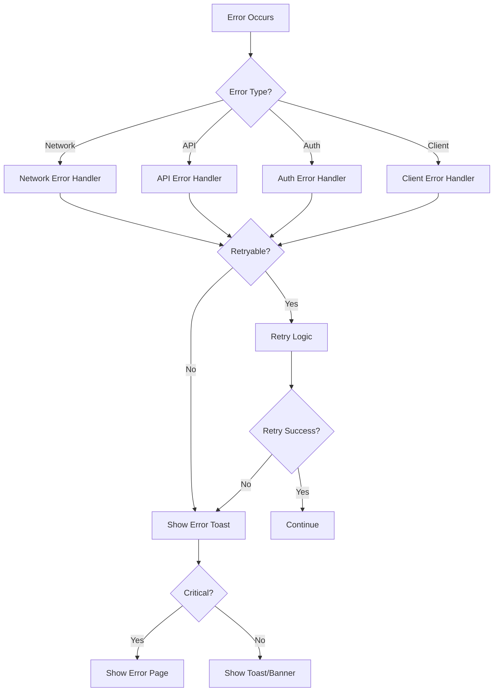

# Error Handling & Loading States

Complete guide for error handling, loading states, and user feedback in the Spotify Playlist Analyzer.

---

## Table of Contents

1. [Error Types & Codes](#error-types--codes)
2. [Error Handling Strategy](#error-handling-strategy)
3. [User Feedback System](#user-feedback-system)
4. [Retry Logic](#retry-logic)
5. [Loading States](#loading-states)
6. [Implementation Guide](#implementation-guide)

---

## Error Types & Codes

### Error Taxonomy

```typescript
// types/errors.ts

export enum ErrorCode {
  // ===== Authentication Errors =====
  AUTH_FAILED = 'AUTH_FAILED',
  TOKEN_EXPIRED = 'TOKEN_EXPIRED',
  SESSION_INVALID = 'SESSION_INVALID',
  UNAUTHORIZED = 'UNAUTHORIZED',

  // ===== Network Errors =====
  NETWORK_ERROR = 'NETWORK_ERROR',
  TIMEOUT = 'TIMEOUT',
  CONNECTION_LOST = 'CONNECTION_LOST',

  // ===== Spotify API Errors =====
  API_ERROR = 'API_ERROR',
  RATE_LIMIT = 'RATE_LIMIT',
  RESOURCE_NOT_FOUND = 'RESOURCE_NOT_FOUND',
  PLAYLIST_NOT_FOUND = 'PLAYLIST_NOT_FOUND',
  TRACK_NOT_PLAYABLE = 'TRACK_NOT_PLAYABLE',

  // ===== Playback Errors =====
  PREMIUM_REQUIRED = 'PREMIUM_REQUIRED',
  PLAYBACK_ERROR = 'PLAYBACK_ERROR',
  NO_ACTIVE_DEVICE = 'NO_ACTIVE_DEVICE',
  PLAYBACK_RESTRICTED = 'PLAYBACK_RESTRICTED',
  PREVIEW_UNAVAILABLE = 'PREVIEW_UNAVAILABLE',

  // ===== Client Errors =====
  INVALID_FILTERS = 'INVALID_FILTERS',
  CACHE_ERROR = 'CACHE_ERROR',
  PARSE_ERROR = 'PARSE_ERROR',
  VALIDATION_ERROR = 'VALIDATION_ERROR',

  // ===== Unknown =====
  UNKNOWN_ERROR = 'UNKNOWN_ERROR',
}

export interface AppError {
  code: ErrorCode;
  message: string;
  userMessage: string;  // User-friendly message
  details?: any;
  retryable: boolean;
  timestamp: string;
  statusCode?: number;
}
```

---

## Complete Error Catalog

### Authentication Errors

| Code | HTTP Status | User Message | Action | Retryable |
|------|-------------|--------------|--------|-----------|
| `AUTH_FAILED` | 401 | "ログインに失敗しました。再度お試しください。" | Redirect to login | No |
| `TOKEN_EXPIRED` | 401 | "セッションの期限が切れました。再ログインしてください。" | Auto-refresh or re-login | Yes (auto) |
| `SESSION_INVALID` | 401 | "セッションが無効です。再ログインしてください。" | Clear session, redirect | No |
| `UNAUTHORIZED` | 403 | "この操作を実行する権限がありません。" | Show error | No |

---

### Network Errors

| Code | HTTP Status | User Message | Action | Retryable |
|------|-------------|--------------|--------|-----------|
| `NETWORK_ERROR` | - | "ネットワークエラーが発生しました。接続を確認してください。" | Show retry button | Yes |
| `TIMEOUT` | 408 | "接続がタイムアウトしました。もう一度お試しください。" | Auto-retry 3x | Yes |
| `CONNECTION_LOST` | - | "インターネット接続が切断されました。" | Show offline banner | Yes (auto) |

---

### Spotify API Errors

| Code | HTTP Status | User Message | Action | Retryable |
|------|-------------|--------------|--------|-----------|
| `API_ERROR` | 500 | "Spotify APIでエラーが発生しました。しばらく待ってから再試行してください。" | Show retry | Yes |
| `RATE_LIMIT` | 429 | "リクエスト数が多すぎます。しばらく待ってから再試行してください。" | Auto-retry with backoff | Yes (auto) |
| `RESOURCE_NOT_FOUND` | 404 | "リソースが見つかりませんでした。" | Go back | No |
| `PLAYLIST_NOT_FOUND` | 404 | "プレイリストが見つかりませんでした。削除された可能性があります。" | Redirect to dashboard | No |
| `TRACK_NOT_PLAYABLE` | 403 | "この曲は再生できません。" | Skip to next | No |

---

### Playback Errors

| Code | HTTP Status | User Message | Action | Retryable |
|------|-------------|--------------|--------|-----------|
| `PREMIUM_REQUIRED` | 403 | "この機能はSpotify Premiumが必要です。" | Show upgrade prompt | No |
| `PLAYBACK_ERROR` | 500 | "再生中にエラーが発生しました。" | Show retry | Yes |
| `NO_ACTIVE_DEVICE` | 404 | "再生デバイスが見つかりません。" | Show device selection | Yes |
| `PLAYBACK_RESTRICTED` | 403 | "この曲は地域制限により再生できません。" | Show info | No |
| `PREVIEW_UNAVAILABLE` | 404 | "プレビューが利用できません。Spotifyアプリで再生してください。" | Show Spotify link | No |

---

### Client Errors

| Code | HTTP Status | User Message | Action | Retryable |
|------|-------------|--------------|--------|-----------|
| `INVALID_FILTERS` | 400 | "無効なフィルター設定です。" | Show validation error | No |
| `CACHE_ERROR` | - | "キャッシュエラーが発生しました。データを再取得します。" | Clear cache, retry | Yes (auto) |
| `PARSE_ERROR` | - | "データの解析に失敗しました。" | Show error | Yes |
| `VALIDATION_ERROR` | 400 | "入力内容に誤りがあります。" | Show field errors | No |

---

## Error Handling Strategy

### Error Handling Flow



---

### Global Error Handler

```typescript
// lib/error-handler.ts

export class ErrorHandler {
  static handle(error: unknown, context?: string): AppError {
    const appError = this.normalize(error);

    // Log error (production: send to monitoring service)
    this.log(appError, context);

    // Show user feedback
    this.showUserFeedback(appError);

    // Track analytics
    this.trackError(appError);

    return appError;
  }

  private static normalize(error: unknown): AppError {
    // Axios/Fetch error
    if (error instanceof Error && 'response' in error) {
      const response = (error as any).response;
      return this.fromHttpError(response);
    }

    // Custom AppError
    if (this.isAppError(error)) {
      return error as AppError;
    }

    // Generic error
    if (error instanceof Error) {
      return {
        code: ErrorCode.UNKNOWN_ERROR,
        message: error.message,
        userMessage: '予期しないエラーが発生しました。',
        retryable: false,
        timestamp: new Date().toISOString(),
      };
    }

    // Unknown error type
    return {
      code: ErrorCode.UNKNOWN_ERROR,
      message: String(error),
      userMessage: '予期しないエラーが発生しました。',
      retryable: false,
      timestamp: new Date().toISOString(),
    };
  }

  private static fromHttpError(response: any): AppError {
    const status = response?.status || 500;
    const data = response?.data;

    switch (status) {
      case 401:
        return {
          code: ErrorCode.TOKEN_EXPIRED,
          message: 'Token expired',
          userMessage: 'セッションの期限が切れました。再ログインしてください。',
          retryable: true,
          timestamp: new Date().toISOString(),
          statusCode: 401,
        };

      case 403:
        return {
          code: ErrorCode.UNAUTHORIZED,
          message: 'Forbidden',
          userMessage: 'この操作を実行する権限がありません。',
          retryable: false,
          timestamp: new Date().toISOString(),
          statusCode: 403,
        };

      case 404:
        return {
          code: ErrorCode.RESOURCE_NOT_FOUND,
          message: 'Resource not found',
          userMessage: 'リソースが見つかりませんでした。',
          retryable: false,
          timestamp: new Date().toISOString(),
          statusCode: 404,
        };

      case 429:
        const retryAfter = response.headers?.['retry-after'];
        return {
          code: ErrorCode.RATE_LIMIT,
          message: 'Rate limit exceeded',
          userMessage: 'リクエスト数が多すぎます。しばらく待ってから再試行してください。',
          retryable: true,
          timestamp: new Date().toISOString(),
          statusCode: 429,
          details: { retryAfter },
        };

      case 500:
      case 502:
      case 503:
        return {
          code: ErrorCode.API_ERROR,
          message: 'Server error',
          userMessage: 'サーバーエラーが発生しました。しばらく待ってから再試行してください。',
          retryable: true,
          timestamp: new Date().toISOString(),
          statusCode: status,
        };

      default:
        return {
          code: ErrorCode.UNKNOWN_ERROR,
          message: data?.message || 'Unknown error',
          userMessage: '予期しないエラーが発生しました。',
          retryable: false,
          timestamp: new Date().toISOString(),
          statusCode: status,
        };
    }
  }

  private static log(error: AppError, context?: string) {
    console.error('[Error]', {
      code: error.code,
      message: error.message,
      context,
      timestamp: error.timestamp,
      details: error.details,
    });

    // Production: Send to monitoring service (e.g., Sentry)
    // if (process.env.NODE_ENV === 'production') {
    //   Sentry.captureException(error);
    // }
  }

  private static showUserFeedback(error: AppError) {
    // Implementation in UI layer
    // toast.error(error.userMessage);
  }

  private static trackError(error: AppError) {
    // Analytics tracking
    // analytics.track('error_occurred', {
    //   code: error.code,
    //   retryable: error.retryable,
    // });
  }

  private static isAppError(error: unknown): boolean {
    return (
      typeof error === 'object' &&
      error !== null &&
      'code' in error &&
      'message' in error &&
      'userMessage' in error
    );
  }
}
```

---

## User Feedback System

### Toast Notifications

```typescript
// components/ui/Toast.tsx

export type ToastType = 'success' | 'error' | 'warning' | 'info';

export interface ToastMessage {
  id: string;
  type: ToastType;
  title: string;
  message: string;
  duration?: number;  // ms, default: 5000
  action?: {
    label: string;
    onClick: () => void;
  };
}

// Usage examples:
toast.success('プレイリストを作成しました');
toast.error('プレイリストの読み込みに失敗しました', {
  action: { label: '再試行', onClick: retry }
});
toast.warning('一部の曲を読み込めませんでした');
toast.info('Spotifyからデータを取得中...');
```

### Toast Design

```
┌────────────────────────────────────┐
│ ✅ Success Title                   │  ← Success (Green)
│ Success message here...            │
│                         [Action]   │
└────────────────────────────────────┘

┌────────────────────────────────────┐
│ ❌ Error Title                     │  ← Error (Red)
│ Error message here...              │
│                         [Retry]    │
└────────────────────────────────────┘

┌────────────────────────────────────┐
│ ⚠️ Warning Title                   │  ← Warning (Orange)
│ Warning message here...            │
│                         [OK]       │
└────────────────────────────────────┘

┌────────────────────────────────────┐
│ ℹ️ Info Title                      │  ← Info (Blue)
│ Info message here...               │
│                         [Dismiss]  │
└────────────────────────────────────┘
```

---

### Error Boundary Component

```typescript
// components/ErrorBoundary.tsx

interface ErrorBoundaryState {
  hasError: boolean;
  error: Error | null;
}

export class ErrorBoundary extends React.Component<
  { children: React.ReactNode; fallback?: React.ReactNode },
  ErrorBoundaryState
> {
  state: ErrorBoundaryState = {
    hasError: false,
    error: null,
  };

  static getDerivedStateFromError(error: Error): ErrorBoundaryState {
    return {
      hasError: true,
      error,
    };
  }

  componentDidCatch(error: Error, errorInfo: React.ErrorInfo) {
    console.error('ErrorBoundary caught:', error, errorInfo);
    // Log to error tracking service
  }

  render() {
    if (this.state.hasError) {
      return this.props.fallback || <ErrorFallback error={this.state.error} />;
    }

    return this.props.children;
  }
}

// Error fallback UI
function ErrorFallback({ error }: { error: Error | null }) {
  return (
    <div className="flex flex-col items-center justify-center min-h-screen p-4">
      <div className="max-w-md text-center">
        <h1 className="text-2xl font-bold mb-4">エラーが発生しました</h1>
        <p className="text-gray-400 mb-6">
          {error?.message || '予期しないエラーが発生しました。'}
        </p>
        <div className="space-x-4">
          <button
            onClick={() => window.location.reload()}
            className="px-4 py-2 bg-primary rounded-lg"
          >
            ページを再読み込み
          </button>
          <button
            onClick={() => window.location.href = '/dashboard'}
            className="px-4 py-2 bg-gray-700 rounded-lg"
          >
            ダッシュボードに戻る
          </button>
        </div>
      </div>
    </div>
  );
}
```

---

## Retry Logic

### Exponential Backoff Strategy

```typescript
// lib/retry.ts

export interface RetryOptions {
  maxRetries: number;
  baseDelay: number;      // ms
  maxDelay: number;       // ms
  shouldRetry: (error: AppError) => boolean;
  onRetry?: (attempt: number, delay: number) => void;
}

export async function withRetry<T>(
  fn: () => Promise<T>,
  options: Partial<RetryOptions> = {}
): Promise<T> {
  const config: RetryOptions = {
    maxRetries: 3,
    baseDelay: 1000,
    maxDelay: 10000,
    shouldRetry: (error) => error.retryable,
    ...options,
  };

  let lastError: AppError | null = null;

  for (let attempt = 0; attempt <= config.maxRetries; attempt++) {
    try {
      return await fn();
    } catch (error) {
      lastError = ErrorHandler.handle(error);

      // Don't retry if not retryable
      if (!config.shouldRetry(lastError)) {
        throw lastError;
      }

      // Last attempt failed
      if (attempt === config.maxRetries) {
        throw lastError;
      }

      // Calculate delay with exponential backoff
      const delay = Math.min(
        config.baseDelay * Math.pow(2, attempt),
        config.maxDelay
      );

      // Add jitter (±25%)
      const jitter = delay * 0.25 * (Math.random() * 2 - 1);
      const finalDelay = Math.max(0, delay + jitter);

      config.onRetry?.(attempt + 1, finalDelay);

      await new Promise(resolve => setTimeout(resolve, finalDelay));
    }
  }

  throw lastError!;
}

// Usage example:
const playlists = await withRetry(
  () => fetchPlaylists(token),
  {
    maxRetries: 3,
    onRetry: (attempt, delay) => {
      console.log(`Retry attempt ${attempt} after ${delay}ms`);
      toast.info(`再試行中... (${attempt}/3)`);
    },
  }
);
```

---

### Rate Limit Specific Retry

```typescript
// lib/api-client.ts

export async function fetchWithRateLimit<T>(
  url: string,
  options: RequestInit = {}
): Promise<T> {
  const response = await fetch(url, options);

  if (response.status === 429) {
    const retryAfter = response.headers.get('Retry-After');
    const waitTime = retryAfter ? parseInt(retryAfter) * 1000 : 2000;

    console.warn(`Rate limited. Waiting ${waitTime}ms...`);

    // Show user feedback
    toast.warning(
      `リクエスト制限に達しました。${Math.ceil(waitTime / 1000)}秒後に再試行します。`
    );

    await new Promise(resolve => setTimeout(resolve, waitTime));

    // Retry
    return fetchWithRateLimit<T>(url, options);
  }

  if (!response.ok) {
    throw new Error(`HTTP ${response.status}`);
  }

  return response.json();
}
```

---

## Loading States

### Loading State Types

```typescript
// types/loading.ts

export type LoadingState =
  | 'idle'
  | 'loading'
  | 'success'
  | 'error';

export interface AsyncState<T> {
  state: LoadingState;
  data: T | null;
  error: AppError | null;
}

// Hook for async operations
export function useAsync<T>() {
  const [state, setState] = useState<AsyncState<T>>({
    state: 'idle',
    data: null,
    error: null,
  });

  const execute = useCallback(async (promise: Promise<T>) => {
    setState({ state: 'loading', data: null, error: null });

    try {
      const data = await promise;
      setState({ state: 'success', data, error: null });
      return data;
    } catch (error) {
      const appError = ErrorHandler.handle(error);
      setState({ state: 'error', data: null, error: appError });
      throw appError;
    }
  }, []);

  return { ...state, execute };
}
```

---

### Loading UI Patterns

#### 1. Skeleton Screen (Preferred)

```typescript
// components/ui/Skeleton.tsx

export function PlaylistCardSkeleton() {
  return (
    <div className="animate-pulse">
      <div className="w-full h-48 bg-gray-800 rounded-lg" />
      <div className="mt-2 h-4 bg-gray-800 rounded w-3/4" />
      <div className="mt-2 h-3 bg-gray-800 rounded w-1/2" />
    </div>
  );
}

// Usage
{isLoading ? (
  <div className="grid grid-cols-4 gap-4">
    {Array.from({ length: 8 }).map((_, i) => (
      <PlaylistCardSkeleton key={i} />
    ))}
  </div>
) : (
  <PlaylistGrid playlists={playlists} />
)}
```

#### 2. Spinner (For smaller components)

```typescript
// components/ui/Spinner.tsx

export function Spinner({ size = 'md' }: { size?: 'sm' | 'md' | 'lg' }) {
  const sizes = {
    sm: 'w-4 h-4',
    md: 'w-8 h-8',
    lg: 'w-12 h-12',
  };

  return (
    <div className={`${sizes[size]} animate-spin rounded-full border-2 border-gray-700 border-t-primary`} />
  );
}
```

#### 3. Progress Bar (For long operations)

```typescript
// components/ui/ProgressBar.tsx

export function ProgressBar({ progress }: { progress: number }) {
  return (
    <div className="w-full bg-gray-800 rounded-full h-2">
      <div
        className="bg-primary h-2 rounded-full transition-all duration-300"
        style={{ width: `${progress}%` }}
      />
    </div>
  );
}

// Usage for batch operations
<div>
  <p>トラックを分析中... {current}/{total}</p>
  <ProgressBar progress={(current / total) * 100} />
</div>
```

---

### Loading State Per Screen

| Screen | Loading Type | Duration | UI |
|--------|--------------|----------|-----|
| Dashboard | Skeleton | < 2s | Grid of skeleton cards |
| Playlist Detail | Skeleton + Spinner | 2-5s | Header skeleton + table rows |
| Track Analysis | Progress Bar | 5-30s | Progress with count |
| Filter Apply | Inline Spinner | < 1s | Small spinner in button |
| Playlist Create | Modal Spinner | 1-3s | Modal with spinner |
| Authentication | Full Page | 1-2s | Centered spinner + logo |

---

## Implementation Guide

### Step-by-Step Integration

#### 1. Setup Error Context

```typescript
// lib/contexts/ErrorContext.tsx

interface ErrorContextType {
  error: AppError | null;
  setError: (error: AppError | null) => void;
  clearError: () => void;
}

export const ErrorContext = createContext<ErrorContextType | null>(null);

export function ErrorProvider({ children }: { children: React.ReactNode }) {
  const [error, setError] = useState<AppError | null>(null);

  const clearError = useCallback(() => setError(null), []);

  return (
    <ErrorContext.Provider value={{ error, setError, clearError }}>
      {children}
    </ErrorContext.Provider>
  );
}

export function useError() {
  const context = useContext(ErrorContext);
  if (!context) throw new Error('useError must be used within ErrorProvider');
  return context;
}
```

#### 2. Wrap API Calls

```typescript
// Example: Dashboard page

export default function Dashboard() {
  const { state, data, error, execute } = useAsync<Playlist[]>();

  useEffect(() => {
    execute(fetchPlaylists());
  }, []);

  if (state === 'loading') {
    return <PlaylistGridSkeleton />;
  }

  if (state === 'error') {
    return <ErrorMessage error={error} onRetry={() => execute(fetchPlaylists())} />;
  }

  return <PlaylistGrid playlists={data || []} />;
}
```

#### 3. Add Toast System

```typescript
// app/layout.tsx

import { Toaster } from '@/components/ui/Toast';

export default function RootLayout({ children }: { children: React.ReactNode }) {
  return (
    <html>
      <body>
        <ErrorBoundary>
          {children}
          <Toaster />  {/* Toast container */}
        </ErrorBoundary>
      </body>
    </html>
  );
}
```

---

## Summary Checklist

✅ **Error Types** - Complete error catalog with codes
✅ **Error Handler** - Global error handling with normalization
✅ **User Feedback** - Toast notifications + error boundaries
✅ **Retry Logic** - Exponential backoff + rate limit handling
✅ **Loading States** - Skeleton screens, spinners, progress bars
✅ **Implementation Guide** - Step-by-step integration

This provides a **production-ready error handling system** that:
- Handles all error scenarios gracefully
- Provides clear user feedback
- Implements smart retry strategies
- Shows appropriate loading states
- Logs errors for debugging

---

**Last Updated:** 2025-10-22
**Version:** 1.0
