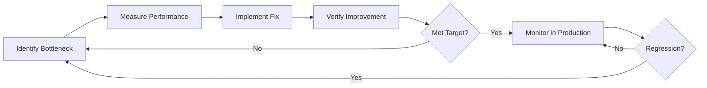

# Performance Optimization Strategy

Complete guide for performance optimization in the Spotify Playlist Analyzer.

---

## Table of Contents

1. [Performance Goals](#performance-goals)
2. [Large Data Handling](#large-data-handling)
3. [Pagination & Virtualization](#pagination--virtualization)
4. [Memoization & Re-rendering](#memoization--re-rendering)
5. [Bundle Size Optimization](#bundle-size-optimization)
6. [Image Optimization](#image-optimization)
7. [API Call Optimization](#api-call-optimization)
8. [Performance Monitoring](#performance-monitoring)

---

## Performance Goals

### Target Metrics

| Metric | Target | Acceptable | Critical |
|--------|--------|------------|----------|
| **First Contentful Paint (FCP)** | < 1.0s | < 1.8s | > 3.0s |
| **Largest Contentful Paint (LCP)** | < 2.0s | < 2.5s | > 4.0s |
| **Time to Interactive (TTI)** | < 3.0s | < 3.8s | > 5.8s |
| **Cumulative Layout Shift (CLS)** | < 0.1 | < 0.25 | > 0.25 |
| **First Input Delay (FID)** | < 100ms | < 300ms | > 300ms |
| **Bundle Size (Initial)** | < 200KB | < 350KB | > 500KB |
| **API Response Time** | < 500ms | < 1000ms | > 2000ms |

### Lighthouse Score Targets

- **Performance**: > 90
- **Accessibility**: > 95
- **Best Practices**: > 95
- **SEO**: > 90

---

## Large Data Handling

### Problem: Rendering 1000+ Tracks

**Challenge:**
- Playlists can contain 1000+ tracks
- Each track has audio features (12+ data points)
- Rendering all at once causes performance issues

### Solution 1: Virtual Scrolling

Use `@tanstack/react-virtual` for windowing.

```typescript
// components/playlist/VirtualTrackList.tsx

import { useVirtualizer } from '@tanstack/react-virtual';
import { useRef } from 'react';

interface VirtualTrackListProps {
  tracks: TrackWithFeatures[];
  onTrackClick: (track: Track) => void;
}

export function VirtualTrackList({ tracks, onTrackClick }: VirtualTrackListProps) {
  const parentRef = useRef<HTMLDivElement>(null);

  const rowVirtualizer = useVirtualizer({
    count: tracks.length,
    getScrollElement: () => parentRef.current,
    estimateSize: () => 64,  // Estimated row height in pixels
    overscan: 10,            // Render 10 extra items above/below
  });

  return (
    <div
      ref={parentRef}
      className="h-[600px] overflow-auto"
    >
      <div
        style={{
          height: `${rowVirtualizer.getTotalSize()}px`,
          width: '100%',
          position: 'relative',
        }}
      >
        {rowVirtualizer.getVirtualItems().map((virtualRow) => {
          const track = tracks[virtualRow.index];

          return (
            <div
              key={track.track.id}
              style={{
                position: 'absolute',
                top: 0,
                left: 0,
                width: '100%',
                height: `${virtualRow.size}px`,
                transform: `translateY(${virtualRow.start}px)`,
              }}
            >
              <TrackRow
                track={track}
                onClick={() => onTrackClick(track.track)}
              />
            </div>
          );
        })}
      </div>
    </div>
  );
}
```

**Performance Impact:**
- **Before:** Render 1000 DOM nodes → Slow
- **After:** Render ~20 visible nodes → Fast
- **Memory:** Reduced by 95%
- **Render Time:** < 16ms (60fps)

---

### Solution 2: Pagination

For dashboard playlist grid.

```typescript
// hooks/usePagination.ts

export function usePagination<T>(items: T[], itemsPerPage: number = 20) {
  const [currentPage, setCurrentPage] = useState(1);

  const totalPages = Math.ceil(items.length / itemsPerPage);
  const startIndex = (currentPage - 1) * itemsPerPage;
  const endIndex = startIndex + itemsPerPage;
  const currentItems = items.slice(startIndex, endIndex);

  const goToPage = (page: number) => {
    setCurrentPage(Math.max(1, Math.min(page, totalPages)));
  };

  return {
    currentItems,
    currentPage,
    totalPages,
    goToPage,
    hasNext: currentPage < totalPages,
    hasPrev: currentPage > 1,
  };
}

// Usage
function Dashboard() {
  const [playlists, setPlaylists] = useState<Playlist[]>([]);
  const {
    currentItems,
    currentPage,
    totalPages,
    goToPage,
    hasNext,
    hasPrev,
  } = usePagination(playlists, 20);

  return (
    <>
      <PlaylistGrid playlists={currentItems} />
      <Pagination
        currentPage={currentPage}
        totalPages={totalPages}
        onPageChange={goToPage}
        hasNext={hasNext}
        hasPrev={hasPrev}
      />
    </>
  );
}
```

---

### Solution 3: Incremental Loading

Load data in chunks as user scrolls.

```typescript
// hooks/useInfiniteScroll.ts

export function useInfiniteScroll<T>(
  fetchMore: (offset: number) => Promise<T[]>,
  initialData: T[] = []
) {
  const [data, setData] = useState<T[]>(initialData);
  const [hasMore, setHasMore] = useState(true);
  const [isLoading, setIsLoading] = useState(false);

  const loadMore = useCallback(async () => {
    if (isLoading || !hasMore) return;

    setIsLoading(true);

    try {
      const newData = await fetchMore(data.length);

      if (newData.length === 0) {
        setHasMore(false);
      } else {
        setData(prev => [...prev, ...newData]);
      }
    } catch (error) {
      console.error('Failed to load more:', error);
    } finally {
      setIsLoading(false);
    }
  }, [data.length, isLoading, hasMore, fetchMore]);

  // Intersection Observer for auto-load
  const observerRef = useRef<IntersectionObserver | null>(null);
  const loadMoreRef = useCallback((node: HTMLDivElement | null) => {
    if (isLoading) return;

    if (observerRef.current) observerRef.current.disconnect();

    observerRef.current = new IntersectionObserver(entries => {
      if (entries[0].isIntersecting && hasMore) {
        loadMore();
      }
    });

    if (node) observerRef.current.observe(node);
  }, [isLoading, hasMore, loadMore]);

  return {
    data,
    isLoading,
    hasMore,
    loadMore,
    loadMoreRef,
  };
}

// Usage
function PlaylistDetailPage() {
  const { data: tracks, isLoading, hasMore, loadMoreRef } = useInfiniteScroll(
    async (offset) => {
      const response = await fetch(`/api/playlist/${id}?offset=${offset}`);
      return response.json();
    }
  );

  return (
    <>
      <TrackList tracks={tracks} />
      {hasMore && (
        <div ref={loadMoreRef} className="h-10 flex items-center justify-center">
          {isLoading && <Spinner />}
        </div>
      )}
    </>
  );
}
```

---

## Pagination & Virtualization

### Performance Comparison

| Method | 100 items | 1000 items | 10000 items |
|--------|-----------|------------|-------------|
| **No optimization** | 50ms | 500ms | 5000ms |
| **Pagination** | 10ms | 10ms | 10ms |
| **Virtual Scrolling** | 5ms | 5ms | 5ms |
| **Memory Usage** | | | |
| No optimization | 50MB | 500MB | 5GB |
| Pagination | 5MB | 5MB | 5MB |
| Virtual Scrolling | 3MB | 3MB | 3MB |

---

## Memoization & Re-rendering

### Problem: Unnecessary Re-renders

Components re-render when parent state changes, even if props don't change.

### Solution 1: React.memo

```typescript
// components/playlist/TrackRow.tsx

export const TrackRow = React.memo(
  ({ track, onPlay }: TrackRowProps) => {
    return (
      <div className="track-row">
        <span>{track.track.name}</span>
        <button onClick={onPlay}>Play</button>
      </div>
    );
  },
  (prevProps, nextProps) => {
    // Custom comparison
    return (
      prevProps.track.track.id === nextProps.track.track.id &&
      prevProps.isPlaying === nextProps.isPlaying
    );
  }
);
```

---

### Solution 2: useMemo

Memoize expensive calculations.

```typescript
// components/playlist/PlaylistStats.tsx

export function PlaylistStats({ tracks }: { tracks: TrackWithFeatures[] }) {
  // ⚠️ BAD: Recalculates on every render
  const avgBpm = tracks.reduce((sum, t) => sum + (t.features?.tempo || 0), 0) / tracks.length;

  // ✅ GOOD: Only recalculates when tracks change
  const avgBpm = useMemo(() => {
    return tracks.reduce((sum, t) => sum + (t.features?.tempo || 0), 0) / tracks.length;
  }, [tracks]);

  const stats = useMemo(() => {
    const bpms = tracks.map(t => t.features?.tempo).filter(Boolean) as number[];
    const energies = tracks.map(t => t.features?.energy).filter(Boolean) as number[];

    return {
      avgBpm: bpms.reduce((a, b) => a + b, 0) / bpms.length,
      medianBpm: bpms.sort()[Math.floor(bpms.length / 2)],
      avgEnergy: energies.reduce((a, b) => a + b, 0) / energies.length,
      keyDistribution: getKeyDistribution(tracks),
    };
  }, [tracks]);

  return <StatsDisplay stats={stats} />;
}
```

---

### Solution 3: useCallback

Prevent function recreation on every render.

```typescript
// components/playlist/FilterPanel.tsx

export function FilterPanel({ onFilterChange }: FilterPanelProps) {
  const [bpmRange, setBpmRange] = useState<[number, number]>([60, 180]);
  const [keys, setKeys] = useState<number[]>([]);

  // ⚠️ BAD: New function on every render
  const handleApply = () => {
    onFilterChange({ bpmRange, keys });
  };

  // ✅ GOOD: Stable function reference
  const handleApply = useCallback(() => {
    onFilterChange({ bpmRange, keys });
  }, [bpmRange, keys, onFilterChange]);

  return (
    <div>
      <BPMSlider value={bpmRange} onChange={setBpmRange} />
      <button onClick={handleApply}>Apply</button>
    </div>
  );
}
```

---

### Solution 4: Context Optimization

Prevent context re-renders from cascading.

```typescript
// lib/contexts/PlaybackContext.tsx

// ⚠️ BAD: Single context causes all consumers to re-render
interface PlaybackContextType {
  currentTrack: Track | null;
  isPlaying: boolean;
  volume: number;
  // ... many more fields
}

// ✅ GOOD: Split into multiple contexts
interface PlaybackStateContext {
  currentTrack: Track | null;
  isPlaying: boolean;
}

interface PlaybackControlsContext {
  play: (track: Track) => void;
  pause: () => void;
  setVolume: (volume: number) => void;
}

// Separate state and controls
export const PlaybackStateContext = createContext<PlaybackStateContext | null>(null);
export const PlaybackControlsContext = createContext<PlaybackControlsContext | null>(null);

// Components only subscribe to what they need
function TrackRow() {
  const { currentTrack } = useContext(PlaybackStateContext);  // Only re-renders when track changes
  const { play } = useContext(PlaybackControlsContext);      // Never re-renders
}
```

---

## Bundle Size Optimization

### Code Splitting

#### 1. Route-Based Splitting

```typescript
// app/layout.tsx

import dynamic from 'next/dynamic';

// Lazy load pages
const Dashboard = dynamic(() => import('./dashboard/page'), {
  loading: () => <DashboardSkeleton />,
});

const PlaylistDetail = dynamic(() => import('./playlist/[id]/page'), {
  loading: () => <PlaylistSkeleton />,
});
```

#### 2. Component-Based Splitting

```typescript
// Lazy load heavy components
const AudioWaveform = dynamic(() => import('@/components/AudioWaveform'), {
  loading: () => <Skeleton className="w-full h-32" />,
  ssr: false,  // Don't render on server
});

const ChartComponent = dynamic(() => import('@/components/BPMChart'), {
  loading: () => <Spinner />,
});
```

#### 3. Library Splitting

```typescript
// Only load when needed
const loadSpotifySDK = async () => {
  if (typeof window !== 'undefined' && !window.Spotify) {
    await import('@spotify/web-playback-sdk');
  }
};

// Usage
useEffect(() => {
  if (isPremium) {
    loadSpotifySDK();
  }
}, [isPremium]);
```

---

### Tree Shaking

Ensure only used code is bundled.

```typescript
// ⚠️ BAD: Imports entire library
import _ from 'lodash';
const result = _.debounce(fn, 300);

// ✅ GOOD: Import only needed function
import debounce from 'lodash/debounce';
const result = debounce(fn, 300);

// ✅ BEST: Use native or lightweight alternatives
const debounce = (fn: Function, delay: number) => {
  let timeoutId: NodeJS.Timeout;
  return (...args: any[]) => {
    clearTimeout(timeoutId);
    timeoutId = setTimeout(() => fn(...args), delay);
  };
};
```

---

### Bundle Analysis

```bash
# Install analyzer
npm install -D @next/bundle-analyzer

# Configure next.config.js
const withBundleAnalyzer = require('@next/bundle-analyzer')({
  enabled: process.env.ANALYZE === 'true',
});

module.exports = withBundleAnalyzer({
  // ... your config
});

# Run analysis
ANALYZE=true npm run build
```

**Target Bundle Sizes:**
- **Initial JS**: < 200KB (gzipped)
- **Total JS**: < 500KB (gzipped)
- **CSS**: < 50KB (gzipped)
- **Per Route**: < 100KB (additional)

---

## Image Optimization

### Next.js Image Component

```typescript
import Image from 'next/image';

// Automatic optimization
<Image
  src={playlist.images[0].url}
  alt={playlist.name}
  width={200}
  height={200}
  loading="lazy"
  placeholder="blur"
  blurDataURL={generateBlurDataURL(playlist.images[0].url)}
/>
```

### Image Formats

**Priority:**
1. **WebP** - Modern format, 25-35% smaller
2. **AVIF** - Even smaller, but less support
3. **JPEG** - Fallback

Next.js automatically serves best format per browser.

### Lazy Loading Strategy

```typescript
// Above the fold: eager loading
<Image src={heroImage} loading="eager" priority />

// Below the fold: lazy loading
<Image src={playlistCover} loading="lazy" />
```

---

## API Call Optimization

### 1. Request Batching

```typescript
// lib/batch-requests.ts

class RequestBatcher {
  private queue: string[] = [];
  private timeout: NodeJS.Timeout | null = null;

  add(id: string) {
    this.queue.push(id);

    if (!this.timeout) {
      this.timeout = setTimeout(() => this.flush(), 50);  // 50ms debounce
    }
  }

  async flush() {
    if (this.queue.length === 0) return;

    const ids = [...this.queue];
    this.queue = [];
    this.timeout = null;

    // Fetch in single request
    const response = await fetch(
      `/api/audio-features?ids=${ids.join(',')}`
    );

    return response.json();
  }
}

// Usage
const batcher = new RequestBatcher();

// Multiple calls within 50ms are batched
batcher.add('track1');
batcher.add('track2');
batcher.add('track3');
// → Single API call with ids=track1,track2,track3
```

---

### 2. Request Deduplication

```typescript
// lib/dedupe.ts

const requestCache = new Map<string, Promise<any>>();

export async function dedupeRequest<T>(
  key: string,
  fn: () => Promise<T>
): Promise<T> {
  // Return existing promise if in flight
  if (requestCache.has(key)) {
    return requestCache.get(key)!;
  }

  // Start new request
  const promise = fn().finally(() => {
    requestCache.delete(key);
  });

  requestCache.set(key, promise);
  return promise;
}

// Usage
const playlists = await dedupeRequest(
  'user-playlists',
  () => fetchPlaylists()
);
```

---

### 3. Prefetching

```typescript
// components/dashboard/PlaylistCard.tsx

import { useRouter } from 'next/navigation';

export function PlaylistCard({ playlist }: { playlist: Playlist }) {
  const router = useRouter();

  const handleMouseEnter = () => {
    // Prefetch on hover
    router.prefetch(`/playlist/${playlist.id}`);
  };

  return (
    <div onMouseEnter={handleMouseEnter}>
      <Link href={`/playlist/${playlist.id}`}>
        {/* ... */}
      </Link>
    </div>
  );
}
```

---

### 4. Parallel Requests

```typescript
// ⚠️ BAD: Sequential (slow)
const playlists = await fetchPlaylists();
const user = await fetchUser();
const features = await fetchFeatures();
// Total: 300ms + 200ms + 500ms = 1000ms

// ✅ GOOD: Parallel (fast)
const [playlists, user, features] = await Promise.all([
  fetchPlaylists(),
  fetchUser(),
  fetchFeatures(),
]);
// Total: max(300ms, 200ms, 500ms) = 500ms
```

---

## Performance Monitoring

### Web Vitals Tracking

```typescript
// app/layout.tsx

import { Analytics } from '@vercel/analytics/react';
import { SpeedInsights } from '@vercel/speed-insights/next';

export default function RootLayout({ children }: { children: React.ReactNode }) {
  return (
    <html>
      <body>
        {children}
        <Analytics />
        <SpeedInsights />
      </body>
    </html>
  );
}
```

---

### Custom Performance Tracking

```typescript
// lib/performance.ts

export class PerformanceTracker {
  private marks = new Map<string, number>();

  start(label: string) {
    this.marks.set(label, performance.now());
  }

  end(label: string) {
    const startTime = this.marks.get(label);
    if (!startTime) return;

    const duration = performance.now() - startTime;
    this.marks.delete(label);

    console.log(`[Performance] ${label}: ${duration.toFixed(2)}ms`);

    // Send to analytics
    if (typeof window !== 'undefined' && window.gtag) {
      window.gtag('event', 'timing_complete', {
        name: label,
        value: Math.round(duration),
        event_category: 'Performance',
      });
    }

    return duration;
  }

  measure(label: string, fn: () => any) {
    this.start(label);
    const result = fn();
    this.end(label);
    return result;
  }

  async measureAsync<T>(label: string, fn: () => Promise<T>): Promise<T> {
    this.start(label);
    try {
      return await fn();
    } finally {
      this.end(label);
    }
  }
}

// Usage
const perf = new PerformanceTracker();

// Sync
perf.start('filter-tracks');
const filtered = filterTracks(tracks, filters);
perf.end('filter-tracks');

// Async
const playlists = await perf.measureAsync('fetch-playlists', () =>
  fetchPlaylists()
);
```

---

### Performance Budget

Set performance budgets in `next.config.js`:

```javascript
module.exports = {
  experimental: {
    optimizePackageImports: ['lucide-react', 'date-fns'],
  },

  // Performance budgets
  webpack: (config, { isServer }) => {
    if (!isServer) {
      config.performance = {
        maxAssetSize: 512000,      // 500KB
        maxEntrypointSize: 512000, // 500KB
        hints: 'warning',
      };
    }
    return config;
  },
};
```

---

## Performance Checklist

### Initial Load
- [ ] First Contentful Paint < 1.8s
- [ ] Largest Contentful Paint < 2.5s
- [ ] Total Bundle Size < 350KB (gzipped)
- [ ] Images optimized with Next/Image
- [ ] Critical CSS inlined
- [ ] Fonts preloaded

### Runtime
- [ ] Virtual scrolling for lists > 100 items
- [ ] Memoization for expensive calculations
- [ ] useCallback for event handlers
- [ ] React.memo for pure components
- [ ] Context split by concern
- [ ] Debounced input handlers

### Network
- [ ] API requests batched where possible
- [ ] Request deduplication implemented
- [ ] Prefetching on hover
- [ ] Parallel requests for independent data
- [ ] Cache strategy implemented
- [ ] Retry logic with backoff

### Code Quality
- [ ] Bundle analyzed with @next/bundle-analyzer
- [ ] Tree shaking verified
- [ ] Code splitting by route
- [ ] Heavy libraries lazy loaded
- [ ] Unused code removed
- [ ] TypeScript strict mode enabled

---

## Optimization Workflow



### Tools

1. **Chrome DevTools**
   - Performance tab
   - Network tab
   - Lighthouse

2. **React DevTools**
   - Profiler
   - Component highlighting

3. **Next.js Analytics**
   - Real User Monitoring
   - Web Vitals

4. **Bundle Analyzer**
   - Size visualization
   - Dependency analysis

---

## Summary

✅ **Large Data**: Virtual scrolling for 1000+ items
✅ **Pagination**: 20 items per page
✅ **Memoization**: useMemo, useCallback, React.memo
✅ **Bundle Size**: < 350KB target
✅ **Code Splitting**: Route and component level
✅ **Images**: Next/Image with lazy loading
✅ **API**: Batching, deduplication, parallel requests
✅ **Monitoring**: Web Vitals, custom tracking

This ensures the app remains fast and responsive even with large datasets.

---

**Last Updated:** 2024-10-22
**Version:** 1.0
